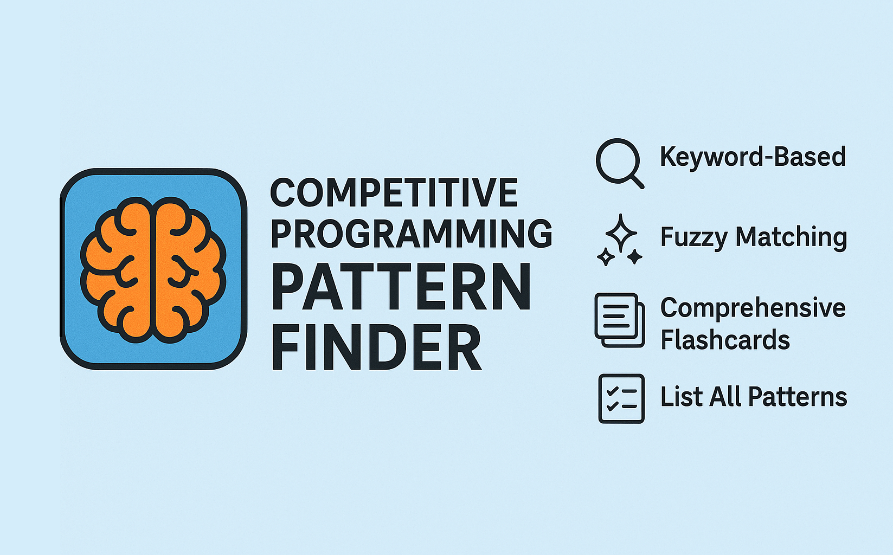

# 🧠 Competitive Programming Pattern Finder

<p align="center" style="padding: 20px;">
  
</p>


A command-line tool to help competitive programmers and software engineers quickly identify the right data structures and algorithms for any problem description.

Instead of memorizing every pattern, use this tool like a digital flashcard system. It uses fuzzy string matching to recommend relevant strategies based on keywords in your input — even if they're slightly misspelled.

## ✨ Features

-   🔍 Keyword-Based Matching
    
    Enter a problem description and get instant pattern suggestions.
    
-   🤖 Fuzzy Search
    
    Handles typos and keyword variations with smart matching logic.
    
-   🧠 Comprehensive Flashcards
    
    Covers a wide range of competitive programming patterns — from arrays to advanced trees.
    
-   📋 List All Patterns
    
    View all flashcards with signals, patterns, and explanations.
    
-   🛠️ Modular Design
    
    Clean separation of logic and data across Python files for easy maintenance and extension.
    

## 🚀 Getting Started

### 🔧 Prerequisites

You need **Python 3** and the `fuzzywuzzy` library to run this tool:

```
pip install fuzzywuzzy[speedup]

```

> The `[speedup]` installs `python-Levenshtein` for faster matching.

### 📦 Installation & Setup

1.  Clone this repository or download the files.
    

```
git clone "https://github.com/AnkitV15/shiny-dollop.git"

```

2.  Navigate to the project root.

```
cd bin
```
    
3.  Add the script's directory to your system’s `PATH` environment variable to use `pattern` globally.
    

## 🧑‍💻 Usage

### 🔍 Find Patterns

```
pattern "find the max subarray sum"

```

The tool will analyze your input and print all relevant flashcards to the console.

### 📋 List All Patterns

```
pattern --list-all
# or
pattern -l

```

Displays all available flashcards with their signals, patterns, and explanations.

## 📂 Project Structure

**File**

**Description**

`main.py`

Entry point for the CLI. Handles user input and flags.

`flashcard_data.py`

Contains all flashcard entries (signals, patterns, reasons).

`pattern_finder.py`

Core logic for fuzzy matching and pattern recommendation.

`README.md`

This file. Explains the project and how to use it.

## 📚 Supported Patterns

Includes foundational and advanced topics such as:

-   Sliding Window, Two Pointers, Prefix Sum
    
-   Binary Search, Hashing, Greedy
    
-   BFS, DFS, Union-Find, Recursion
    
-   Segment Tree, Fenwick Tree (BIT), Trie
    
-   Monotonic Stack, Heap, Bitmasking
    
-   Dynamic Programming, Game Theory
    
-   KMP, Modular Arithmetic, Sieve
    

> Want to add more? Just extend `flashcard_data.py` with new entries!

## 💡 Example Flashcard Output

```
---
🧩 Problem Type: Array Manipulation
🔍 Signals: sliding window, max subarray, window, range, contiguous
🧠 Patterns to Apply: Sliding Window, Prefix Sum, Two Pointers
📌 Why It Works: Optimize over contiguous segments

```

## 🤝 Contributing

Contributions are welcome! You can:

-   Add new flashcards or signals
    
-   Improve the fuzzy matching logic
    
-   Suggest UX improvements for the CLI
    

Open an issue or submit a pull request to get started.

## 🧠 Philosophy

This tool is built for clarity, speed, and recall. Whether you're prepping for contests or interviews, it helps you map problem signals to strategies — without unnecessary clutter. Think in patterns, solve with confidence.